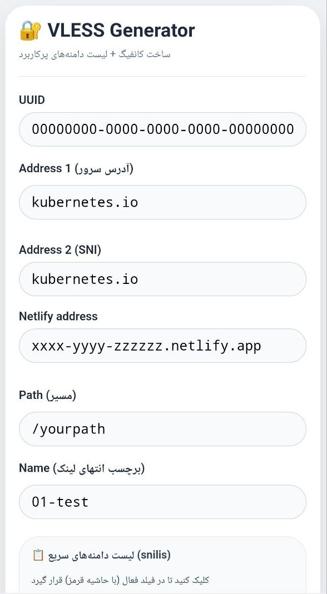
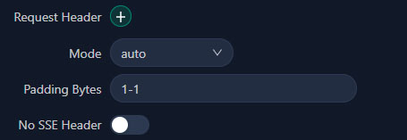

# 🔐 VLESS Config Generator – ابزار آنلاین تولید کانفیگ VLESS

> ابزار تحت وب، بدون نیاز به نصب – مشابه برنامه دلفی با قابلیت کپی یک‌کلیکی و ذخیره خودکار

---

## 🌐 دسترسی آنلاین (برای استفاده مستقیم کلیک کنید)

👉 **[https://worldof01.github.io/Netlify-V2ray-Generator/](https://worldof01.github.io/Netlify-V2ray-Generator/)** 👈

> روی لینک بالا کلیک کنید تا سایت باز شود. نیازی به دانلود یا نصب هیچ نرم‌افزاری نیست.

---

## ✨ امکانات اصلی

- تولید لینک **VLESS** با فرمت استاندارد (شامل `xhttp`، `tls`، `alpn`، `padding` و...)
- کپی خودکار لینک در کلیپ‌بورد (**Clipboard API** + Fallback)
- ذخیره تمام مقادیر در **مرورگر کاربر** (localStorage) – مشابه فایل INI در دلفی
- لیست دامنه‌های پرکاربرد (snilis) برای درج سریع در فیلدهای آدرس
- **حاشیه قرمز** برای فیلدهای فعال (همانند Shape در دلفی)
- طراحی **ریسپانسیو** و سازگار با موبایل، تبلت و دسکتاپ
- بدون نیاز به سرور اختصاصی – میزبانی رایگان روی **GitHub Pages**

---

## 🖥️ نحوه استفاده

1. فیلدهای زیر را مقداردهی کنید:
   - **UUID** – شناسه یکتا
   - **Address 1** – آدرس سرور اصلی
   - **Address 2** – SNI (Server Name Indication)
   - **Netlify address** – آدرس هاست (مثلاً پروژه Netlify)
   - **Path** – مسیر (به صورت خودکار URL-encode می‌شود)
   - **Name** – برچسب انتهای لینک

2. اگر می‌خواهید از دامنه‌های آماده استفاده کنید:
   - ابتدا روی فیلد **Address 1** یا **Address 2** کلیک کنید تا حاشیه قرمز شود.
   - سپس روی هر گزینه در بخش **«لیست دامنه‌های سریع»** کلیک کنید. مقدار آن در فیلد فعال درج می‌شود.

3. دکمه **«✨ تولید لینک و کپی در کلیپ‌بورد»** را بزنید.  
   لینک نهایی در کادر پایین نمایش داده شده و به طور خودکار در کلیپ‌بورد کپی می‌شود.

4. لینک را در کلاینت‌های سازگار با VLESS (مانند v2rayN، Nekoray، V2Box، Sing-box، Hiddify و ...) وارد کنید.

---

## ⚙️ تنظیم مهم برای اینباند (Padding Bytes)

اگر از **سرور شخصی (اینباند)** استفاده می‌کنید، حتماً مقدار **Padding Bytes** را روی **`1-1`** تنظیم کنید. در غیر این صورت کانفیگ به درستی کار نخواهد کرد.

تصویر زیر محل تنظیم این پارامتر را در پنل نشان می‌دهد:

> **توضیح:** پارامتر `extra={"xPaddingBytes":"1-1"}` در لینک تولیدی به کار رفته و سرور باید با این تنظیمات مطابقت داشته باشد.

---

